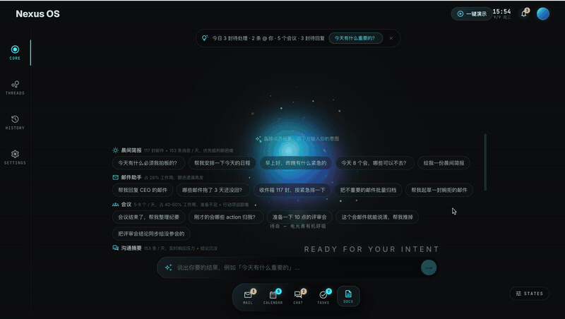

# Nexus OS — AI 存在范式 Demo

<p align="center">
  
</p>

一个"无 App 时代"的 AI 交互范式演示，面向**打工人办公场景**（PRD v1.0）。

核心交互实体是一个能量光球（Energy Orb），通过 8 态状态机表达 AI 的存在感与理解过程；用户只说意图，系统自动跨邮件 / 会议 / IM / 文档执行，结果以产物卡片的形式在光球周围涌现。

## 快速开始

```bash
npm install
npm run dev
```

浏览器打开 http://localhost:5173/

## 30 秒体验路径

1. 打开页面 — 光球呼吸，底部 Dock 显示今日待处理密度
2. 点顶部提示条或说「今天有什么重要的」→ 晨间简报卡片涌现
3. 点 Dock 邮件图标 → 收件箱按 VIP / 待回复分类
4. 在邮件卡片点「生成回复」→ 编辑草稿 → 「确认发送」
5. 说「会议结束了，帮我整理纪要」→ 决策 / 行动项 / 同步 Jira

## P0 功能（PRD v1.0 §5.1）

| 功能 | 入口 | 说明 |
|------|------|------|
| 智能晨间简报 | 「今天有什么重要的」/ Dock 日历 | 聚合邮件、@ 提及、会议，5 分钟掌握全天，节省 55 分钟 |
| 邮件 AI 助手 | 「看看重要邮件」/ Dock Mail | 四级智能分类 + AI 回复草稿 + 用户确认后发送 |
| 会议纪要生成 | 「整理会议纪要」/ Dock Tasks | 决策 / 行动项（责任人+截止）/ 相关文档 + 同步 Jira、发送参会人 |
| Dock 任务栏 | 底部 | 不是 App 启动器，而是**意图入口**，图标直接派发意图 |
| 系统托盘 | 顶栏右侧 | 实时时钟、通知中心、今日累计节省时长 |

> 电量 / 网络属于设备级状态，Web App 无从感知，因此不模拟——本 Demo 是桌面 Web 应用，不是移动端状态栏。

P1 已部分落地：工作沟通摘要（`#project-alpha` 频道）、文档跨源语义检索。

## 设计要点

- **意图驱动**：没有 App 图标、没有菜单，用户只表达"要什么"
- **听 + 懂协议**：光球状态流转之外，用 AI 复述（"明白，我把…汇总成晨间简报"）让用户先修正理解再执行
- **external-action 二次确认**：发邮件、同步 Jira 等有副作用的动作必须用户点确认
- **空间化布局**：产物停靠在 focus / near / far 三个槽位，新任务出现时不跳位
- **价值可视化**：每个场景完成时累计"今日节省时长"，顶栏常驻

## 项目结构

```
src/
├── agents/              # Agent 逻辑层（PRD v1.0 §5.3）
│   ├── types.ts         # 领域模型 + 产物数据契约 + 节省时长口径
│   ├── BriefAgent.ts    # 晨间简报
│   ├── EmailAgent.ts    # 智能分类 / 回复草稿
│   ├── MeetingAgent.ts  # 会议纪要
│   ├── MessageAgent.ts  # 沟通摘要
│   └── DocumentAgent.ts # 文档检索
├── mock/                # mock 数据：emails / meetings / messages / documents
├── logic/
│   ├── intentRouter.ts  # 关键词路由 + 风险分级 + AI 复述
│   ├── artifactFactory.ts # 意图 → 产物
│   └── intentFlow.ts    # 8 态状态流转编排
├── components/
│   ├── orb/             # 能量光球 + 状态机定义
│   ├── cards/           # 产物卡片（Email / Meeting / Message / Doc / Brief / 生活场景）
│   ├── panels/          # 晨间简报条
│   ├── dock/            # Dock 意图入口
│   ├── system-tray/     # 系统托盘 + 通知中心
│   └── controls/        # 命令栏 + 状态切换调试
├── store/               # Zustand：光球状态 / 产物 / 通知 / 节省时长
└── App.tsx
```

## 开发命令

```bash
npm run dev        # 启动开发服务器
npm run build      # 构建生产产物
npm run typecheck   # 类型检查
npm run lint        # 静态代码检查
```

## 边界（PRD §1.4 Non-Goals）

真实 LLM 调用、真实系统权限、持久化存储、多用户均**不在**本 Demo 范围内。所有 AI 响应为预设脚本模拟，验证的是交互范式而非模型准确率。

## 文档

- `doc/agent-os-prd.md` — PRD v1.0（打工人调研 + 竞品分析 + 设计方案 + Demo 计划）
- `doc/dev-plan.html` — 开发实现计划 v0.2（8 态状态机、精确视觉参数、Sprint 验收清单）
- `doc/competitor-analysis-report.md` — 竞品分析报告
- `DESIGN.md` — 架构设计文档
